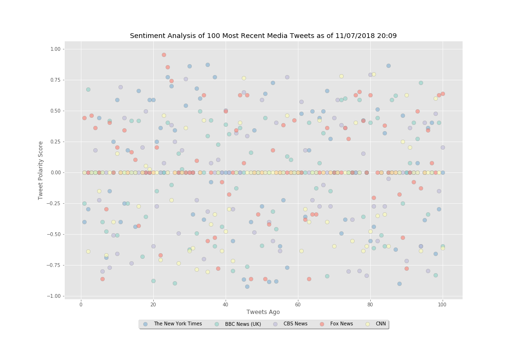

# Feeling Out the News Mood

Photo by [Branden Harvey](https://unsplash.com/photos/wyN0QFDiXw0?utm_source=unsplash&utm_medium=referral&utm_content=creditCopyText) on [Unsplash](https://unsplash.com/search/photos/good-newspaper?utm_source=unsplash&utm_medium=referral&utm_content=creditCopyText)

The objective of this challenge is to pull the 100 most recent tweets of seveal news sources and run VADER sentiment analysis on each. Compound scores are then visualized individually and as a whole to see what meaning can be derived from these scores.

### Analysis

Visualization of each individual sentiment score saw a small concentration of neutral scores upon running, but no other distinct trends emerge. Considering that these analyses are run on news sources, one might wonder what this implies about journalistic objectivity. Considering that objectivity is a central tennant of journalism ethics, one would hope to see a such a concentration. However, contents of the news itself would likely influence these scores as well. See below for visual.

This program was run the day after the 2018 US Midterm Elections, so it was a big news day. Considering the known partisan biases of Fox News and CNN, it is interesting to see that their compound sentiment scores occupied the upper and lower limits of the data: Fox News had the most positve score, and CNN had the most negative score. Among the headlines: Democrats took back the House of Representatives, Attorney General Jeff Sessions resigned, and Trump held one of his most combative press conferences to date. One wonders what impact these events had on the tweets coming from these sources.

